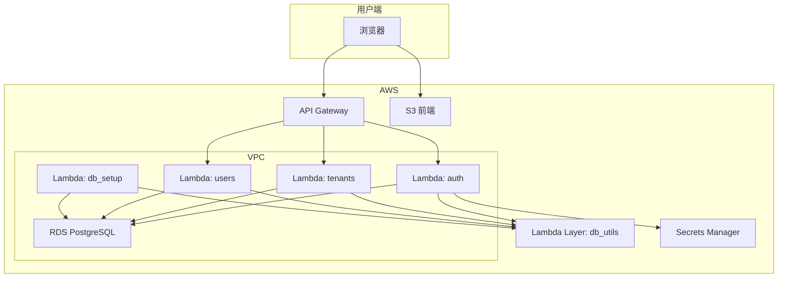

# 智汇-ERP 系统设计与架构文档

本文档说明「智汇-ERP」前后端整体架构、组件职责、数据流、部署方式与近期修改，便于维护与二次开发。

---

## 1. 默认凭证与密码策略

开发/演示用固定凭证如下。**登录名与邮箱为两个独立字段**。

| 角色 / 服务     | 登录用户名   | 密码     | 关联邮箱 (非登录) | 作用范围           |
|----------------|-------------|----------|-------------------|--------------------|
| 超级管理员     | `superadmin`| `test1234`| N/A               | 平台后台，管理租户 |
| 数据库主用户   | `postgres`  | `test1234`| N/A               | RDS 管理员         |
| 租户管理员     | `admin`     | `123456` | `admin@example.com`  | 租户 ERP，管理企业 |
| 租户-财务      | `fin`       | `123456` | `fin@example.com`    | 租户 ERP，财务     |
| 租户-仓库      | `wh`        | `123456` | `wh@example.com`     | 租户 ERP，仓库     |
| 租户-销售      | `sales`     | `123456` | `sales@example.com`  | 租户 ERP，销售     |

- 平台级（超级管理员、数据库）使用 `test1234`；租户内预设用户统一 `123456`。
- 前端「账号」栏输入的是**登录用户名**（如 `admin`），非邮箱。

---

## 2. 工程目录与关键文件

前后端分离：`智汇云-erp`（前端）、`backend`（后端）；部署定义在项目根目录。

```
. (项目根)
├── template.yaml              # SAM/CloudFormation 模板（Lambda、RDS、API、S3 等）
├── samconfig.toml             # SAM 部署配置（栈名 joriapp-erp-backend、区域等）
├── 智汇云-erp/                 # 前端 Vite + React + TypeScript
│   ├── App.tsx                 # 入口：登录 / SaaS 管理 / 租户 ERP 路由
│   ├── api/                    # axios 封装、baseURL、login/getTenants
│   ├── pages/
│   │   ├── LoginPage.tsx       # 登录（租户选择、超级管理员/移动端 demo）
│   │   ├── SaasAdmin.tsx       # 超级管理员后台入口与子路由
│   │   ├── saas-admin/         # SaaS 管理模块
│   │   │   ├── index.tsx       # 主仪表盘（租户列表、统计）
│   │   │   ├── tenants/[tenantId].tsx  # 单租户管理控制台
│   │   │   ├── plans.tsx       # 订阅方案
│   │   │   ├── industries.tsx  # 行业
│   │   │   └── tickets.tsx     # 工单中心
│   │   ├── Dashboard.tsx       # 租户内 ERP 仪表盘
│   │   └── ...                 # 其他业务页（订单、库存、财务等）
│   ├── components/             # Layout、Sidebar 等
│   ├── utils/
│   │   └── saasUtils.tsx       # getTenantsArrayFromResponse、transformTenantFromApi、StatCard 等
│   └── types.ts                # User、Tenant、Plan 等类型
├── backend/
│   ├── lambda/
│   │   ├── layers/database_utils/  # db_utils（连接、JWT、build_response）
│   │   ├── auth/                   # 登录 API
│   │   ├── tenants/                # 租户 CRUD、列表（公开/管理员）
│   │   ├── saas_admin/             # /admin/plans、/admin/industries
│   │   ├── users/                  # 租户内用户管理
│   │   ├── tickets/                # 工单
│   │   ├── db_setup_assets/        # schema_public.sql、schema_tenant.sql、seed、db_setup.py
│   │   ├── db_setup_invoker/       # Custom Resource 处理器，部署时调用 DbSetup
│   │   └── ...
│   └── (无独立 template，使用根目录 template.yaml)
└── docs/
    ├── debug-tenant-list-curl.sh   # curl 调试：登录 + GET /api/tenants
    └── DEBUGGING-TENANT-LIST.md    # 租户列表为空时的排查步骤
```

---

## 3. 初始数据与角色

### 3.1 订阅方案 (Plans)

定义于 `backend/lambda/db_setup_assets/schema_public.sql`：

- **基础版 (`basic`)**：核心进销存。
- **专业版 (`pro`)**：基础版 + 移动端、高级报表。
- **企业版 (`enterprise`)**：专业版 + AI 分析、开放平台、专属支持。

### 3.2 行业 (Industries)

预设行业分类，租户注册时可选，用于分析与定制。

### 3.3 Demo 租户与用户

DbSetup 会创建 **demo** 租户，并预设用户：

| 登录名  | 密码     | 角色       | 说明           |
|--------|----------|------------|----------------|
| `admin`| `123456` | 租户管理员 | 最高权限       |
| `fin`  | `123456` | 财务       | 报表、应收应付 |
| `wh`   | `123456` | 仓库       | 库存、出入库   |
| `sales`| `123456` | 销售       | 订单、客户     |

---

## 4. 后台体系

- **超级管理员后台**：`superadmin` 登录后进入。租户列表、创建/停用/删除租户、订阅方案与行业管理、工单中心等；对应 API 为 `/api/tenants`、`/admin/*`。
- **租户管理员后台**：各租户的 `admin` 登录后进入。用户管理、权限、企业设置及 ERP 业务（进销存、财务等）；数据按租户 schema 隔离。

---

## 5. 部署方式

### 5.1 环境与首次部署

```bash
aws configure
sam build
sam deploy --guided   # 栈名等会写入 samconfig.toml，默认栈名 joriapp-erp-backend
```

### 5.2 后端更新

```bash
sam build && sam deploy
```

部署时会通过 Custom Resource 自动执行 DbSetup（建表、写入 demo 租户）。若 RDS 未就绪会重试。

### 5.3 前端构建与上传 S3

```bash
cd 智汇云-erp && npm install && npm run build
aws s3 sync 智汇云-erp/dist/ s3://<FrontendBucketName> --delete
```

桶名从 CloudFormation 输出获取：

```bash
aws cloudformation describe-stacks --stack-name joriapp-erp-backend \
  --query "Stacks[0].Outputs[?OutputKey=='FrontendBucketName'].OutputValue" --output text
```

### 5.4 前端访问地址

```bash
aws cloudformation describe-stacks --stack-name joriapp-erp-backend \
  --query "Stacks[0].Outputs[?OutputKey=='FrontendURL'].OutputValue" --output text
```

---

## 6. 高层架构

- **前端**：SPA，托管于 **S3** 静态网站。
- **入口**：**API Gateway (HTTP API)**，路由与 CORS。
- **计算**：**Lambda**（auth、tenants、saas_admin、users、tickets、db_setup、db_setup_invoker 等）。
- **数据**：**RDS PostgreSQL**，多租户为「共享库 + 每租户独立 schema」。
- **安全**：**VPC**、**IAM**、**Secrets Manager**（超级管理员密码）。
- **共享逻辑**：**Lambda Layer** `db_utils`（连接、JWT 校验、search_path）。



---

## 7. 后端资源清单（与 template.yaml 对应）

| 类型       | 逻辑 ID / 名称        | 说明 |
|------------|------------------------|------|
| S3         | FrontendBucket         | 前端静态网站 |
| HTTP API   | ZhiHuiErpHttpApi       | 统一入口，CORS |
| 网络       | VPC、Public/Private 子网、NAT、安全组 | Lambda、RDS 在 VPC 内 |
| RDS        | DBInstance             | PostgreSQL，public + tenant_* schema |
| 凭据       | SuperAdminSecret       | 超级管理员（Secrets Manager） |
| Layer      | DatabaseUtilsLayer     | db_utils |
| Lambda     | AuthFunction           | POST /api/auth/login |
| Lambda     | TenantsFunction        | GET/POST /api/tenants、/api/tenants/:id/* |
| Lambda     | SaasAdminFunction      | /admin/{proxy+}（plans、industries 等） |
| Lambda     | UsersFunction          | 租户内用户管理 |
| Lambda     | TicketsFunction        | 工单 API |
| Lambda     | DbSetupFunction        | 执行 schema + seed，创建 demo 租户 |
| Lambda     | DbSetupInvokerFunction | Custom Resource 处理器，部署时调用 DbSetup（带重试） |
| Custom Res.| DbSetupCustomResource  | 依赖 DbSetupFunction、DBInstance |
| Lambda     | DebugDbDumpFunction    | 调试用 |

---

## 8. 核心组件说明

### 8.1 API Gateway

路径与方法映射到对应 Lambda（如 `/api/auth/login` → AuthFunction，`/api/tenants` → TenantsFunction），并配置 CORS。

### 8.2 Lambda 与 db_utils

- **get_public_connection()**：仅 public schema，用于登录页租户列表等无需 JWT 的请求。
- **get_tenant_db_connection(schema)**：指定租户 schema，用于登录时校验该租户下的用户。
- **get_db_connection(event)**：根据 JWT 设置 search_path——超级管理员为 `public`，租户用户为 `tenant_<id>`；无效则返回 None。

### 8.3 多租户数据模型

- **public**：`tenants`、`plans`、`industries`、`tickets` 等全局表。
- **tenant_1, tenant_2, ...**：每租户独立 schema，内含 users、products、orders 等业务表。

---

## 9. 关键数据流

### 9.1 超级管理员登录并查看租户列表

1. 前端：`superadmin` + `test1234`，不选租户，POST /api/auth/login。
2. AuthFunction：校验 Secrets Manager 中的超级管理员，返回 JWT（含 `is_super_admin`）及 user。
3. 前端：存 token，请求 GET /api/tenants，Header：`Authorization: Bearer <token>`。
4. TenantsFunction：get_db_connection(event) → search_path=public，查询 public.tenants，返回完整列表（id 已转字符串等）。
5. 前端：getTenantsArrayFromResponse(response.data) 取数组，transformTenantFromApi 后 setState 渲染表格。

### 9.2 租户用户登录

1. 前端：选租户（如 demo）、用户名、密码，POST /api/auth/login，body 含 tenantDomain。
2. AuthFunction：查 public.tenants 得 schema → get_tenant_db_connection(schema)，校验 users 表，返回 JWT（含 tenant_id）及 user（含 role、name、tenant_id 等）。
3. 前端：存 token，根据 user.role 做 hasAccess，进入租户内 ERP 或无权限页。

### 9.3 租户列表展示（前端容错）

- 先单独请求 GET /api/tenants 并 setTenants，再并行请求 /admin/plans、/admin/industries；plans/industries 失败不影响租户列表。
- getTenantsArrayFromResponse 兼容 response.data 为数组或带 body 的 Lambda 代理格式。

---

## 10. 近期修改记录

### 10.1 租户用户登录后白屏

- **原因**：登录返回的 user 缺少 role/name，前端 hasAccess 依赖 user.role，无权限时渲染的 UnauthorizedPage 为空 div。
- **后端**（`backend/lambda/auth/auth.py`）：租户用户登录返回中补全 name、fullName、role（admin/sales/warehouse/finance/staff）、tenant_id。
- **前端**（`智汇云-erp/App.tsx`）：hasAccess 在 role 缺失时默认视为 admin；UnauthorizedPage 改为文案 +「返回仪表盘」按钮。

### 10.2 超级管理员登录后租户一览为空

- **原因 1（后端）**：DbSetup 未自动执行或执行失败（触发器重复创建报错），public.tenants 无数据。
- **后端**：  
  - schema_public.sql：在相关 CREATE TRIGGER 前增加 DROP TRIGGER IF EXISTS，脚本可重复执行。  
  - DbSetup：打 [DBSETUP_DEBUG] 日志（连接库、commit 后 public.tenants 行数）。  
  - DbSetupInvoker：Custom Resource 处理器，部署时调用 DbSetup，带重试。  
  - template.yaml：DbSetupInvokerFunction、DbSetupInvokerPermission、DbSetupCustomResource。  
  - TenantsFunction：打 [TENANTS_DEBUG]（current_database、current_schema、行数、首行），返回列表 id 转为字符串。
- **原因 2（前端）**：Promise.all 中 /admin/plans 或 /admin/industries 失败导致整次 fetch 失败，setTenants 未执行；且未兼容 Lambda 代理 body 格式。
- **前端**：  
  - saasUtils.tsx：getTenantsArrayFromResponse；transformTenantFromApi 中 id/plan_code 转字符串、status 枚举、created_at 字符串。  
  - saas-admin/index.tsx：先单独请求 /api/tenants 并 setTenants，再请求 plans/industries。  
  - saas-admin/tenants/[tenantId].tsx：租户列表用 getTenantsArrayFromResponse 解析。

### 10.3 登录页与移动端

- LoginPage：移动端默认租户由占位符改为 `demo`。
- 智汇云-erp：安装 @types/react、@types/react-dom，消除 React/JSX 相关 TS 报错。

### 10.4 调试与运维

- **docs/debug-tenant-list-curl.sh**：superadmin 登录后 GET /api/tenants，不经过前端验证后端。
- **docs/DEBUGGING-TENANT-LIST.md**：用 curl 与 CloudWatch 中 [TENANTS_DEBUG]、[DBSETUP_DEBUG] 对比库与行数；必要时手动执行 DbSetup 确保 demo 存在。
